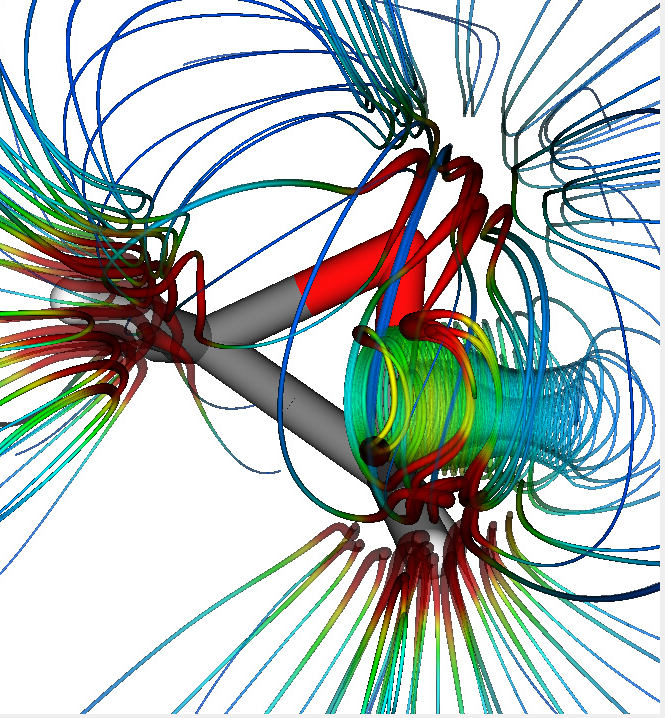

# Plotting Streamtubes with vtk

Minimal working example written in python3 that plots a vector field of a molecular system stored
in a [Gaussiancube file](https://gaussian.com/cubegen/) using VTK and
[vtkMolecule](https://vtk.org/doc/nightly/html/classvtkMolecule.html)
class.
The render is put inside a Qt windows.
(PySide2.QtWidgets.QMainWindow)

Requirements:
* numpy
* vtk
* PySide2

